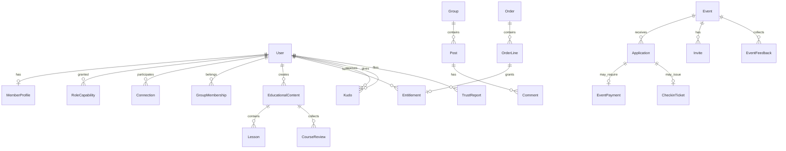

# VelvetKey Platform Plan

**Product:** VelvetKey (epicsexual.com)  
**Positioning:** A knowledge-centered social community for adults exploring ENM, polyamory, swinging, and kink. Community-led discovery, learning, and gatherings—not a dating or matchmaking product.  
**Stack (confirmed):** Next.js App Router, NestJS, TypeORM, PostgreSQL (local demo + production target), JWT auth, optional Stripe Connect for test/local demo.  
**Last updated:** 2026-10-05

---

## 1. Vision and principles

### Confirmed

- **Community first:** Profiles, groups, discussions, and education are the long-term core; events are one module inside the platform.
- **Not a dating app:** No swipe/match feed, no “find dates near you” as a primary job-to-be-done. Connection features support community participation, not algorithmic pairing.
- **One account, many hats:** A single member can be attendee, host, and educator; capabilities are granted by roles and entitlements, not separate products.
- **Safety is separate from praise:** Event/course reviews, public kudos, and confidential misconduct reports remain distinct systems. Kudos never override enforcement.
- **Preserve the event demo:** The working host → invite → apply → approve → pay (test) → QR → check-in → analytics path stays a explicit milestone and regression contract (`docs/DEMO.md`, backend e2e).

### Open decisions

- Minimum age verification policy at signup vs. at paid content / event purchase.
- Default visibility for new members (public profile vs. community-only vs. connections-only).
- Media storage provider and moderation pipeline (S3-compatible assumed; vendor TBD).
- Production payment provider approval timeline and acceptable use for adult education + events marketplace.
- Whether live workshops use integrated video or external links initially.

---

## 2. What exists today (inventory)

Review of `main` as of the merged MVP event loop. **Extend** where noted; **new module** where not present.

| Area | Status | Location / notes |
|------|--------|------------------|
| Auth (email/password, JWT, HttpOnly cookie) | Shipped | `backend/src/auth`, `frontend/app/auth` |
| Roles `host`, `attendee`, `admin` | Shipped | `UserEntity.roles` JSON array |
| Event CRUD, publish/cancel, ticket price | Shipped | `events/` |
| Applications, dynamic forms, CoC on apply | Shipped | `applications/` |
| Invites (generate, validate, redeem, stats) | Shipped | `invites/` |
| Waitlist + promote | Shipped | `applications.service` |
| Stripe Connect onboarding + status | Shipped | `stripe/stripe.service` |
| Event checkout, webhook fulfillment, idempotent confirm | Shipped (test mode) | `stripe-payments.service`, `webhook.controller` |
| QR tickets, single-use verify | Shipped | `checkin/` |
| Optional photo check-in | Shipped | `photo-checkin.service` |
| Event-scoped chat (HTTP + Socket.IO) | Shipped | `chat/` — **extend pattern** for DMs later |
| Post-event feedback (1–5 rating + comment) | Shipped | `feedback/` — **not** member kudos; keep separate |
| Host analytics funnel | Shipped | `analytics/` |
| Trust reports, export, delete account | Shipped | `trust/` |
| Admin moderation + audit log | Shipped | `admin/` |
| Persona IDV (optional per event) | Shipped, optional | `identity/` — fails safe when unconfigured |
| Email (Resend-ready, outbox) | Partial | `email/` — templates exist; production optional |
| Member profile (bio, interests, avatar, visibility) | **New** | Only `name`, `email` on user today |
| Connections / follows / blocks | **New** | Blocking may extend trust; no graph yet |
| Groups, forums, posts, feed | **New** | |
| DMs / member messaging | **New** | Reuse chat auth patterns |
| Education catalog, lessons, entitlements | **New** | |
| Member kudos | **New** | Distinct from event feedback ratings |
| Course reviews | **New** | Distinct from kudos and reports |
| Payment abstraction (provider-agnostic orders) | **Partial** | Event payments tied to Stripe; needs `Order` / `Entitlement` layer |
| Community discovery of events | **Partial** | Public event list; no group-scoped or social graph discovery |

---

## 3. Module boundaries (target architecture)

NestJS modules should stay cohesive; frontend mirrors these as route groups.

```
platform/
├── identity/          # auth, account, roles, session (existing auth + extend profile)
├── members/           # NEW: profile, preferences, visibility, blocks
├── social/            # NEW: connections, groups, posts, discussions, media refs
├── messaging/         # NEW: DMs; may share infra with chat/ (adapters)
├── education/         # NEW: creators, content, lessons, progress, course reviews
├── commerce/          # NEW: orders, entitlements, refunds; adapters/stripe (events migrate in)
├── events/            # EXISTING: lifecycle, invites, applications (unchanged contract)
├── events-payments/   # EXISTING stripe checkout for tickets → delegates to commerce over time
├── checkin/           # EXISTING
├── kudos/             # NEW: positive recognition only
├── trust/             # EXISTING: reports, CoC, export, delete
├── feedback/          # EXISTING: event feedback (keep name; do not merge with kudos)
├── admin/             # EXISTING: extend for content + kudos moderation
├── analytics/         # EXISTING: extend dashboards per module
├── chat/              # EXISTING: event rooms; optional split later
└── notifications/     # FUTURE: email + in-app
```

**Integration rules**

- Event invitations grant **event application eligibility only**, not community-wide access.
- Education content may link to groups and events but purchases grant **content entitlements only**.
- `commerce` records `Order`, `OrderLine`, `Refund`, `PayoutAllocation`; Stripe is one `PaymentProvider` implementation.
- Kudos reference `experienceType` + optional `contextId` (event, course, group); never aggregate into a single “score.”

---

## 4. Data relationships (conceptual)



**Confirmed modeling choices**

- `User.id` remains the stable `sub` across modules (no separate “member id”).
- Event payment rows evolve toward referencing `commerce.orders` rather than duplicating money state.
- Kudos rows: `giverId`, `recipientId`, `experienceType`, `message`, `contextType`, `contextId`, `status` (pending_approval | published | hidden), `verifiedContext` (bool), timestamps; **no** rollup columns on `MemberProfile`.

**Open decisions**

- Normalized tags for interests vs. free-text + moderation.
- Group privacy levels (public / request / invite-only).
- Whether course progress is per-lesson or per-module only.

---

## 5. Permissions and capabilities

### Role flags (existing)

| Role | Purpose |
|------|---------|
| `attendee` | Apply, purchase, learn, participate in community |
| `host` | Manage events, invites, applications, check-in, event analytics |
| `admin` | Platform moderation, audit, user status |

### Capability flags (proposed extensions on profile or role metadata)

| Capability | Enables |
|------------|---------|
| `educator` | Publish educational content, set prices, view learner progress for own content |
| `creator_paid` | Accept payments when provider approved; until then draft paid content as “pending payout setup” |
| `community_moderator` | Optional delegated mod (subset of admin on groups/content) |

### Visibility (member profile & contact)

Granular controls per field/group: **public**, **members**, **connections**, **private**.  
Contact actions (message, kudos, connection request) respect target’s settings and blocks.

### Enforcement hierarchy (confirmed)

1. Confidential **trust reports** and admin **enforcement** (suspend, ban, exclude from event/org).  
2. **Organizer exclusions** (host blocklist for their events).  
3. **Member blocks** (dyadic).  
4. Public **kudos** and **reviews**—never substitute for (1).

---

## 6. Navigation (information architecture)

Current nav is event-centric (`AppNav`: Events, host dashboard, payments). Target incremental IA:

| Area | Primary routes (proposed) |
|------|-------------------------|
| Home | `/` — blended discovery: events + featured learning + community highlights (phased) |
| Community | `/community`, `/groups/[id]`, `/groups/[id]/discussions/[id]` |
| Learn | `/learn`, `/learn/[slug]`, `/learn/[slug]/lessons/[id]`, `/creators/[id]` |
| Events | `/events/[id]`, `/host/events/*` (keep current host workspace) |
| Messages | `/messages`, `/messages/[threadId]` |
| Profile | `/members/[id]`, `/settings/profile`, `/settings/privacy`, `/settings/payouts` |
| Trust | `/trust/report`, `/trust/code-of-conduct` (existing) |
| Admin | `/admin/*` (existing) |

**Confirmed:** Host event workspace tabs (Edit, Form, Invites, Applications, Check-in, Analytics, Feedback, Chat) remain as today.  
**Open:** Global search entry point and mobile tab bar ordering.

---

## 7. Payments and access (provider-agnostic)

### Confirmed

- Local demo continues to use **Stripe test mode** for event tickets (`docs/DEMO.md`).
- Production **must not assume** Stripe approval; design for **provider replacement** without rewriting event or education business logic.
- Fulfillment stays **idempotent** (checkout session id / order id as idempotency key).

### Target `commerce` concepts

| Entity | Responsibility |
|--------|----------------|
| `Order` | Buyer, currency, status, provider, providerRef |
| `OrderLine` | Event ticket, course purchase, workshop seat |
| `Entitlement` | Grants access until `revokedAt` or expiry |
| `Refund` | Ties to order line; triggers entitlement revocation |
| `PayoutAllocation` | Host/educator share; settled when provider supports Connect/marketplace |

### Refund / cancel (confirmed requirements, open policy details)

- Event cancelled → define whether auto-refund or host-initiated; ticket and check-in invalidated.
- Course refund → revoke entitlement; learner progress retained but locked (or policy: delete progress—**open**).

---

## 8. Phased backlog

Each phase is independently shippable. **Not** a single big-bang launch.

### Milestone M0 — Event demo stable (CURRENT)

**Goal:** Rehearsable paid-event journey for investors and hosts.

**Acceptance criteria**

- [ ] All items in `docs/DEMO.md` checklist pass on Postgres docker profile.
- [ ] Backend e2e: auth, journey, stripe, checkin, applications, invites green.
- [ ] Frontend production build green.

**Dependencies:** None (baseline).

---

### Milestone M1 — Community participation (profiles + groups lite) — **IN PROGRESS (core shipped)**

**Goal:** Members present themselves and join topic spaces without dating mechanics.

**Scope**

- Member profile: display name, bio, interests/tags, links, avatar URL, visibility matrix.
- Connection requests (optional v1: follow-only instead of mutual—**open**).
- Block list (dyadic); integrates with messaging and kudos attempts.
- Groups: create, join, roles (owner/mod/member), discussion threads, basic posts (text + link).
- Event discovery: list published events on home; optional “related group” link on event page.

**Acceptance criteria**

- [x] Edit profile; other members see fields per visibility rules (`/settings/profile`, `GET/PATCH /members/me/profile`).
- [x] Create group, post, comment; private groups hidden from non-members (`/community`, `/groups/*`).
- [x] Block prevents profile view and group join with blocked owner (`POST /members/:id/block`).
- [ ] Follow graph surfaced in UI beyond profile pages (API shipped).
- [ ] Event invite flow unchanged; event access still requires application path (unchanged; verify in regression).

**Dependencies:** M0.  
**Extends:** `UserEntity` → `MemberProfile`; new `social` module.  
**New:** Media upload strategy (even if v1 is URL-only).

---

### Milestone M2 — Educational publishing (free + drafts) — **SHIPPED (core)**

**Goal:** Members publish searchable free instructional content.

**Scope**

- Educator capability flag; creator profile section.
- Content types: guide, tutorial, multi-lesson course (structure only), external workshop link.
- Draft → publish workflow; lesson ordering; preview for non-owners.
- Tie content to groups (cross-links); search/filter by tag.
- Content reporting → trust pipeline (reuse report categories + admin queue).

**Acceptance criteria**

- [x] Educator creates draft course, adds lessons, publishes (`/learn`, `POST /learn/*`).
- [x] Any member can view free published content and complete lessons with progress stored.
- [x] Report content (`subjectType: content` on trust reports); admin queue unchanged.

**Dependencies:** M1 (profile + groups recommended).  
**New:** `education` module; `LessonProgress` entity.

---

### Milestone M3 — Paid learning + entitlements — **SHIPPED (core)**

**Goal:** Sell access to content/workshops with the same rigor as event tickets.

**Scope**

- Introduce `commerce` module; migrate event ticket payments to create `Order` + `Entitlement` (adapter wraps existing Stripe checkout).
- Paid courses: preview lesson + paywall; purchase grants entitlement.
- Creator payout setup reuses Connect-style onboarding generalized to “payout account” (**open** provider).
- Refund path revokes entitlement; idempotent webhook handling.

**Acceptance criteria**

- [x] Purchase course in test mode; entitlement gates non-preview lessons (`commerce_*` + `/learn/:slug/checkout`).
- [x] Idempotent fulfillment via `providerRef` (session id).
- [x] Refund revokes entitlements (`POST /commerce/test/refund/:providerRef` in test).
- [x] Event ticket fulfillment also writes `event_ticket` orders (stripe fulfill path).

**Dependencies:** M2, M0 payment patterns.  
**Open:** Production provider swap adapter interface; live Stripe refund webhooks; workshop seat limits.

---

### Milestone M4 — Member kudos

**Goal:** Optional positive recognition without reputation scores.

**Scope**

- Kudo types (configurable enum): e.g. `welcoming`, `knowledge_sharing`, `respectful_communication`, `event_contribution`.
- Giver submits; recipient **approves** public display; either party can hide later.
- Context link to event/course/group when verified (attended, purchased, shared membership).
- Anti-abuse: rate limits, no self-kudos, detect reciprocal pairs, cap per pair per type per period, admin suppress.
- Profile section “Kudos shared with me” — no totals, no leaderboard, no “verified safe person” badge.

**Acceptance criteria**

- [ ] Submit kudo → pending → recipient approves → visible on profile.
- [ ] Reciprocal spam pattern throttled.
- [ ] Trust report and suspension hide kudos display; enforcement unchanged.
- [ ] Event feedback stars remain on event host analytics only—not on member profiles.

**Dependencies:** M1 profiles; optional M0 event attendance for verified event kudos.  
**New:** `kudos` module.

---

### Milestone M5+ (later, not launch blockers)

- Full messaging (DMs, group chat merge with event chat infrastructure).
- Notifications center (email + in-app).
- Advanced moderation (appeals workflow expansion, organizer exclusion lists exported).
- Redis adapter for chat scaling (already noted in README).
- Production payment provider onboarding (non-Stripe adapter if required).

---

## 9. Reviews and accountability map

| System | Scope | Audience | Aggregated? |
|--------|-------|----------|-------------|
| Event feedback | Specific event | Host (aggregate) | Yes, per event |
| Course review | Specific course | Creator + learners | Yes, per course |
| Member kudos | Member behavior | Profile visitors | **No** global score |
| Trust report | Misconduct | Admin only | No |

**Confirmed:** Positive kudos do not affect report outcomes or visibility of enforcement.

---

## 10. Technical constraints (unchanged unless proven insufficient)

- NestJS modules + TypeORM migrations; no ORM switch.
- Next.js App Router; shared UI tokens (`frontend/app/components/ui`).
- E2e tests for every new API surface touching money, access, or safety.
- Optional features (Persona, email, Stripe) **fail closed or degrade gracefully** when unconfigured.

**When to reconsider stack**

- Real-time feed at very large scale → evaluate dedicated search (Meilisearch/Elastic) — **not yet**.
- Video hosting for workshops → CDN/provider — **defer** to M3+ workshop decision.

---

## 11. Taskmaster / doc hygiene

- **M0** aligns with completed Taskmaster master tasks and `docs/DEMO.md`.
- **M1–M4** should get separate tags (`platform-community`, `platform-education`, `platform-commerce`, `platform-kudos`) when work starts; do not overload `master` with subtasks.
- Archive superseded scope in `.taskmaster/docs/refined-prd-2026.txt` with a pointer to this file (event-only phases remain historical).

---

## 12. Summary

VelvetKey evolves from a **proven event operations core** into a **community and learning platform** where gatherings are one module among profiles, groups, education, and positive kudos—explicitly **not** a dating product. The existing Next.js/NestJS/PostgreSQL investment is preserved; new work is modular, phased, and gated by clear acceptance criteria, with payments and production monetization blocked on provider approval rather than assumed.
